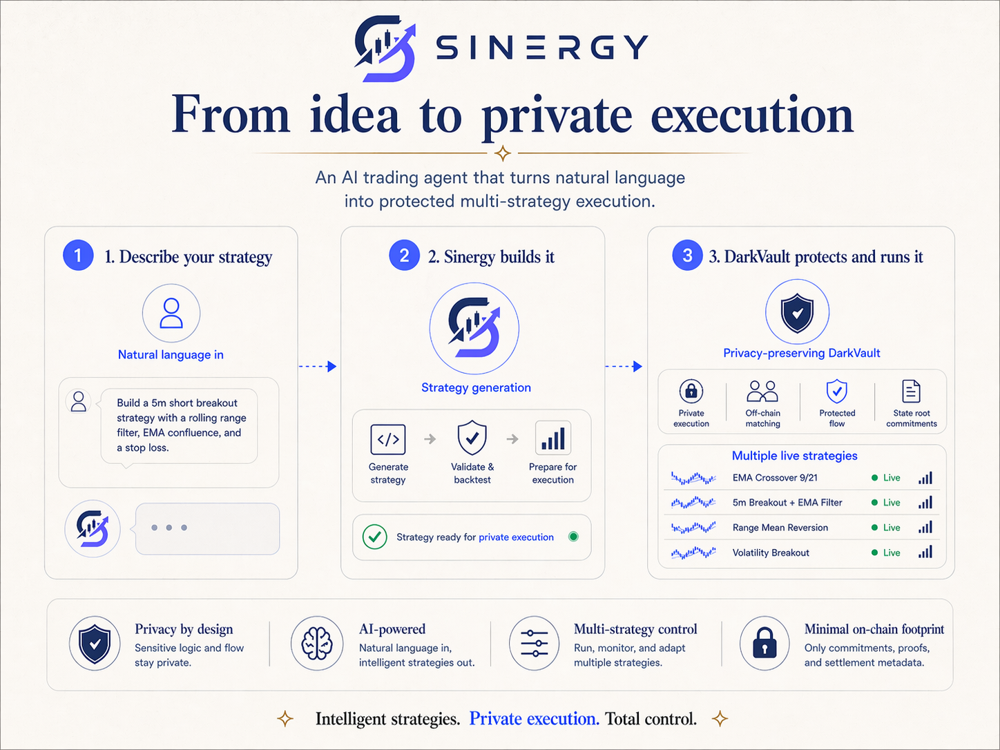
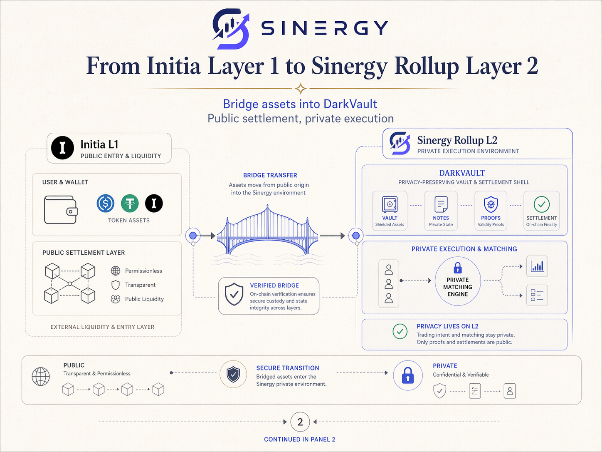
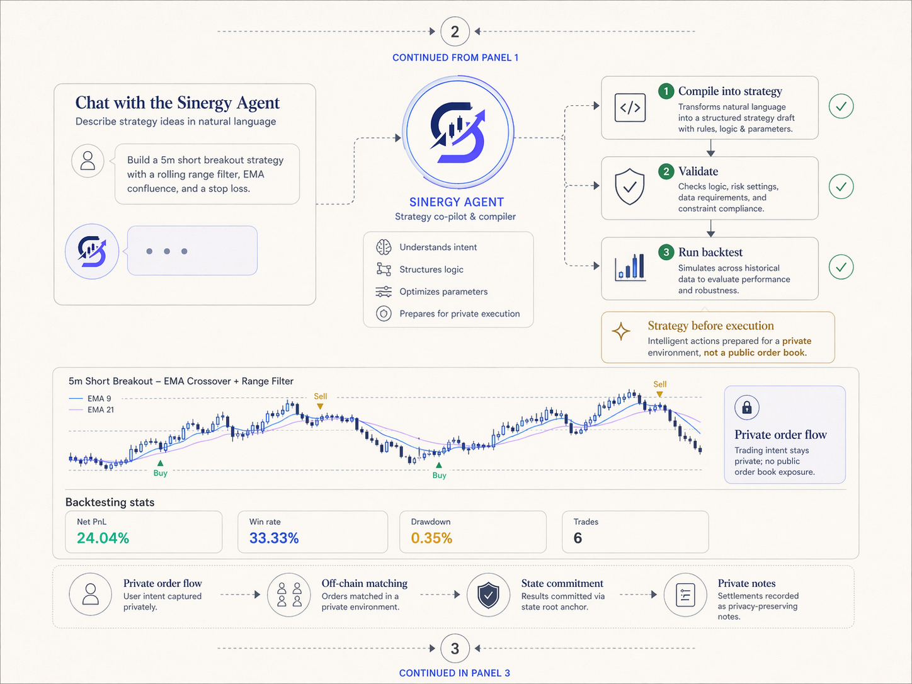
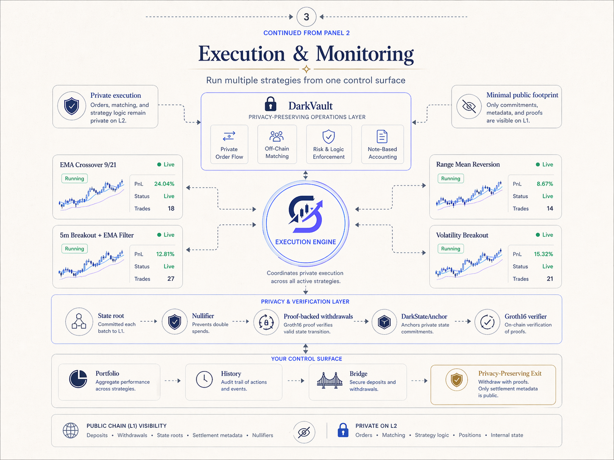

# Sinergy

Sinergy is an agent-powered private trading appchain built natively on Initia, designed for privacy-first trading with seamless automatic execution.

It transforms natural-language trading intents into validated, secure executions. By combining an AI strategy agent, privacy-preserving infrastructure, and native Initia liquidity routing, Sinergy offers a seamless, next-generation DeFi experience tailored for the Initia ecosystem.

At its core, Sinergy is about making advanced trading feel simple without forcing users to expose their full intent on public rails. Instead of broadcasting strategy logic, order flow, and execution decisions to an open orderbook, Sinergy keeps sensitive trading coordination inside a private execution layer while still anchoring custody and settlement guarantees on `Sinergy-2`.

## Live MVP

The Sinergy MVP is functional and publicly available for judges during the hackathon review period:

**[Launch the Sinergy Trading Agent MVP](https://app.sinergyco.xyz/)**

The live MVP runs from a private server and is published through a Cloudflare Tunnel, so the origin server does not need to expose router ports directly to the public Internet. The tunnel routes the public Sinergy testnet surfaces to the private deployment, including the trading web app, bridge UI, matcher API, rollup RPC, REST, Tendermint, websocket, and indexer endpoints.

## Judge Quick Start

Sinergy's demo flow is best evaluated as a guided path from user intent to private execution:

1. **Describe a strategy** in natural language.
2. **Let the Sinergy Agent compile, validate, and backtest it** before capital is deployed.
3. **Bridge assets from Initia L1 into `Sinergy-2`** through the DarkVault flow.
4. **Authorize, execute, and monitor live strategies** while only commitments, proofs, and settlement metadata are public.

| What to review | Where |
| --- | --- |
| Main app | [`apps/web`](apps/web) |
| Bridge app | [`apps/bridge`](apps/bridge) |
| Strategy agent | [`services/strategy-agent`](services/strategy-agent) |
| Private matcher and router | [`services/matcher`](services/matcher) |
| EVM contracts | [`contracts/src`](contracts/src) |
| ZK withdrawal circuit | [`circuits/withdrawal.circom`](circuits/withdrawal.circom) |
| Testnet deployment | [`deployments/testnet.json`](deployments/testnet.json) |

## Visual Demo Flow

### 1. From Idea to Private Execution



Users describe their trading idea in plain language. Sinergy turns that intent into a validated, backtested strategy that can be authorized, funded, and executed inside DarkVault.

### 2. From Initia L1 to Sinergy Rollup L2



Assets enter from Initia L1 through a verified bridge flow. Public settlement and custody guarantees remain anchored on-chain, while execution and matching move into the `Sinergy-2` private environment.

### 3. Agent Compilation, Validation, and Backtesting



The Sinergy Agent compiles a strategy draft, validates the rules and risk settings, and runs historical backtests before live execution. The goal is to make advanced strategy creation feel conversational without exposing the trading plan to a public orderbook.

### 4. Execution and Monitoring



Once approved, strategies run from one control surface. Orders, matching, strategy logic, positions, and internal state stay private on L2; deposits, withdrawals, state roots, settlement metadata, and nullifiers remain publicly verifiable.

## What Is Working Today

- **Initia-native wallet UX** through `InterwovenKit`, including Initia username display when available.
- **Natural-language strategy generation** through the Strategy Agent.
- **Rule validation and historical backtesting** before execution.
- **Signed live strategy approvals** using typed execution intents.
- **Manual approved execution** through `/strategy/execution/execute`.
- **Automatic strategy execution** through an `AutoStrategyWorker` that monitors active strategies and runs new checks.
- **Live strategy dashboard and execution history** with status, live overlays, trade rows, and PnL summaries.
- **Private matcher and router** for internal fills and external liquidity routing sourced from Initia Layer 1.
- **DarkVault settlement flow** with a minimal public footprint.
- **MiniEVM rollup deployment** on `Sinergy-2`.
- **OPinit bridge-oriented asset flow** for connected Initia assets.
- **ZK withdrawal architecture** with a Circom withdrawal circuit and Groth16 verifier path.

Current live execution support is intentionally scoped: automatic execution is enabled for router-backed markets such as `cINIT/cUSDC` and `cETH/cUSDC`, and live short execution is not enabled yet.

### Automatic Strategy Execution Proof

Recent `Sinergy-2` testnet transactions showing automatic strategy executions:

- [`CE4475F9DA21C56CCC982E0ACCFED043A1140C6DB9CDF11FA5A1857CBB7EDCD3`](https://scan.testnet.initia.xyz/initiation-2/txs/CE4475F9DA21C56CCC982E0ACCFED043A1140C6DB9CDF11FA5A1857CBB7EDCD3)
- [`33B3B8E53ED648A481AA35EC5A216C3A9EA5737A72DC1007B0EB4501E7E05934`](https://scan.testnet.initia.xyz/initiation-2/txs/33B3B8E53ED648A481AA35EC5A216C3A9EA5737A72DC1007B0EB4501E7E05934)
- [`D4F4A91A5846AB2DA588CB5E327E2E17F079C317AED64014F9BDE7040FF2FE9B`](https://scan.testnet.initia.xyz/initiation-2/txs/D4F4A91A5846AB2DA588CB5E327E2E17F079C317AED64014F9BDE7040FF2FE9B)
- [`11A28B27350D83477ADE71B5CC928F7030529FB54ACFD85441236B7C106084F4`](https://scan.testnet.initia.xyz/initiation-2/txs/11A28B27350D83477ADE71B5CC928F7030529FB54ACFD85441236B7C106084F4)

## How It Works

1. **Natural Language Input**: Users connect their wallet via `InterwovenKit` and describe their trading strategy in plain language.
2. **Contextual Awareness**: The agent input layer automatically builds the necessary prompt payload with real-time market and timeframe context.
3. **AI Strategy Generation**: The AI agent interprets the request, drafts the strategy constraints, and orchestrates necessary trading tools.
4. **Validation & Backtesting**: The system strictly validates rules and runs historical backtesting to ensure the strategy behaves as intended *before* any capital is deployed.
5. **Execution Approval**: The user signs a typed execution intent for the saved strategy, including strategy hash, market, nonce, deadline, and slippage guardrails.
6. **Live Execution**: Approved strategies can be executed manually or activated for automatic monitoring by the matcher-side `AutoStrategyWorker`.
7. **Private Settlement**: Execution state is anchored securely and privately on our `Sinergy-2` MiniEVM rollup.
8. **Smart Routing**: When needed, the private matcher can source liquidity through router-backed markets connected to Initia liquidity.

## Why Privacy Matters in Sinergy

Most on-chain trading systems leak valuable information before a trade is fully complete: user intent, order timing, portfolio positioning, and routing behavior can all become visible to external observers. Sinergy is designed to reduce that leakage.

Our privacy model keeps:

- **Order flow private** so user strategies are not posted to a public on-chain orderbook.
- **Execution coordination private** so matching and routing logic happen away from public mempool-style observation.
- **Settlement verifiable** by anchoring the resulting state and custody flows on `Sinergy-2`.
- **Liquidity composable** by routing to `InitiaDEX` and `Initia L1` only when external liquidity is actually needed.

This gives users a better default trading experience: less strategy leakage, less signaling to the market, and a stronger path toward confidential DeFi execution on Initia.

## Why We Built This for the Initiate Hackathon

Sinergy was designed from the ground up to showcase the unique capabilities of the Initia network. Rather than porting a generic EVM application, we built an **appchain-native product** that deeply integrates Initia primitives to support privacy-first trading UX:

- **InterwovenKit** for a fluid, Initia-native wallet connection and signing UX.
- **MiniEVM** on `Sinergy-2` customized for private trading execution.
- **Connected Assets** seamlessly utilizing `cINIT`, `cUSDC`, `cETH`, `cBTC`, and `cSOL`.
- **OPinit Bridge** infrastructure for robust cross-chain interoperability.
- **Native Interoperability** via direct liquidity routing through `InitiaDEX`.

Sinergy also natively surfaces Initia usernames for connected wallets. When a wallet has a registered username on `initiation-2`, the app displays `<name>.init`, falling back to the shortened address if not.

## Core Architecture Components

- **Agent Layer**: Translates natural-language strategy intent into an executable plan, complete with validation and repair loops.
- **Dark Vault**: Secures user funds within the settlement flow while minimizing the on-chain footprint and exposure of trading intent.
- **Private Matcher & Router**: Handles private balances, executes local fills, and arbitrates external liquidity routing.
- **Strategy Execution Engine**: Evaluates saved strategies against live candles, records execution history, and coordinates approved router swaps or no-action checks.
- **Bridge-Backed Assets**: Natively operates using Initia-connected bridging standards.

## Live Testnet Snapshot

- **Rollup**: `Sinergy-2`
- **Rollup VM**: MiniEVM
- **L1**: `initiation-2`
- **Connected assets**: `cINIT`, `cUSDC`, `cETH`, `cBTC`, `cSOL`
- **Router-enabled markets**: `cINIT/cUSDC`, `cETH/cUSDC`
- **Dark-pool markets**: `cBTC/cUSDC`, `cSOL/cUSDC`, `tAAPL/cUSDC`, `tBOND/cUSDC`, `tNVDA/cUSDC`
- **Runtime deployment file**: [deployments/testnet.json](deployments/testnet.json)

## Roadmap

Sinergy's next product layer expands the current private execution system into a marketplace for strategy ownership, monetization, and agent-native payments.

- **x402 payments per agent message**: Because `Sinergy-2` is a MiniEVM rollup, Sinergy can explore x402-compatible payments using `eip155:<chainId>` network identifiers. The goal is to let users or agents pay per strategy generation, validation, backtest, or execution instruction without traditional accounts or subscriptions.
- **Strategy marketplace**: Users will be able to create strategies with the Sinergy Agent, then publish them into a marketplace as protected strategy products.
- **Strategy NFTs**: A validated strategy can be minted as a Strategy NFT, making the strategy unique, ownable, and verifiable while keeping the sensitive execution logic protected.
- **Sell or rent strategies**: Strategy owners will be able to monetize their edge by selling access, renting time-limited usage rights, or collecting royalties when strategies are reused.
- **Protected execution by default**: DarkVault will continue to protect strategy logic, execution coordination, and internal matching, so monetized strategies do not have to expose their full rules publicly.
- **Trust and verification layer**: Marketplace listings are intended to include verified strategy metadata, encrypted logic, state commitments, private execution guarantees, off-chain matching, secure transactions, and proof-backed security.

---

## Local Development & Evaluation Guide

For judges and developers evaluating Sinergy locally, follow these steps to run the environment.

### Fast Demo Startup

If the machine already has the rollup configured, the fastest way to bring the public demo back after a reboot is:

```bash
./scripts/start-testnet-stack.sh
./scripts/public-nginx.sh start
./scripts/cloudflare-tunnel.sh quick
```

Useful health checks:

```bash
./scripts/start-testnet-stack.sh status
./scripts/public-nginx.sh status
./scripts/cloudflare-tunnel.sh status
```

What these commands do:
- `start-testnet-stack.sh`: Restores the rollup, executor, relayer, matcher, and frontends.
- `public-nginx.sh start`: Serves the public app, bridge, API, RPC, and related endpoints.
- `cloudflare-tunnel.sh quick`: Exposes the stack to the internet without opening router ports.

```bash
# Restart all services (stop + start)
./scripts/restart-testnet-stack.sh

# Stop all services
./scripts/restart-testnet-stack.sh stop

# Start all services
./scripts/restart-testnet-stack.sh start

# Check status
./scripts/restart-testnet-stack.sh status
```

### Manual Setup & Source Build

Install dependencies:

```bash
npm install
```

Start the main web app:

```bash
npm run dev:web
```

Start the dedicated matcher:

```bash
npm run dev:matcher
```

Start the strategy agent:

```bash
npm run dev:strategy-agent
```

#### Strategy Agent Configuration

The Strategy Agent uses OpenAI's GPT-5.4-nano model by default. To configure it:

1. Copy the example environment file:
```bash
cp services/strategy-agent/.env.example services/strategy-agent/.env
```

2. Add your OpenAI API key to `services/strategy-agent/.env`:
```bash
AGENT_MODEL_API_KEY=sk-your-openai-api-key-here
```

3. Configure the reasoning effort for GPT-5.4-nano:
```bash
AGENT_MODEL_REASONING_EFFORT=low
```

Available reasoning levels:
- `none`: No reasoning, fastest and cheapest
- `low`: Minimal reasoning (recommended for gpt-5.4-nano)
- `medium`: Balanced reasoning (default)
- `high`: More thorough reasoning
- `xhigh`: Maximum reasoning depth

The agent supports any OpenAI-compatible API endpoint and model.

#### Matcher Authentication

Sensitive matcher actions now use a lightweight wallet-based authentication flow. Instead of trusting a plain `userAddress` or `evmAddress` in the request body, the frontend asks the matcher for a one-time nonce, the connected EVM wallet signs the returned message, and the matcher exchanges that signed challenge for a short-lived bearer token.

This token is then attached automatically by the web and bridge frontends for user-scoped routes such as:

- `balances` and `orders`
- `swap/quote` and `swap/execute`
- `vault` deposit/withdrawal sync and quote/package actions
- `bridge/claim` and `bridge/redeem`
- strategy execution and strategy-tool routes that act on a specific `ownerAddress`

The matcher verifies that the authenticated wallet matches the address referenced by the request before allowing the action. Read-only public endpoints such as market discovery and public price data remain accessible without login.

Optional matcher auth environment variables:

- `AUTH_TOKEN_SECRET`
  override the default token-signing secret derived from the matcher key
- `AUTH_NONCE_TTL_MS`
  lifetime of the one-time login challenge
- `AUTH_TOKEN_TTL_MS`
  lifetime of the issued bearer token

This is intentionally a low-friction first layer. It substantially improves protection for wallet-scoped EVM actions, but it does not by itself prove ownership of every non-EVM identifier used elsewhere in the system.

#### ZK Architecture Support

If you want to exercise the ZK withdrawal path locally, compile and prepare the circuit artifacts first:

```bash
npm run zk:compile:withdrawal
npm run zk:setup:withdrawal -- /path/to/powersOfTau.ptau
node scripts/zk/export-withdrawal-vkey-calldata.mjs > .tmp/zk/withdrawal/vkey-calldata.json
```

The source for this proof system lives in [`circuits/`](circuits), currently with [`circuits/withdrawal.circom`](circuits/withdrawal.circom) as the main withdrawal circuit. This file defines the private statement proven during a withdrawal: a note exists in the committed Merkle tree, it matches the requested `token` and `amount`, the prover knows the note secret, and the derived `nullifier` prevents double withdrawal. In practice, this directory is the cryptographic source of truth for the Groth16 withdrawal flow used by the matcher and verified on-chain by `DarkVaultV2`.

Then deploy or configure the ZK stack so `deployments/local.json` contains:
- `contracts.zkVault`
- `contracts.stateAnchor`
- `contracts.withdrawalVerifier`

The matcher expects the compiled circuit files at `.tmp/zk/withdrawal/withdrawal_js/withdrawal.wasm` and `.tmp/zk/withdrawal/withdrawal_final.zkey` unless overridden with `ZK_WITHDRAWAL_WASM_FILE` and `ZK_WITHDRAWAL_ZKEY_FILE`.

#### Local Strategy Execution Contract

The local `StrategyExecutor` contract used for onchain strategy approval consumption is currently deployed at:

- `0x3Db7923385663Fd3410db197AE794ce861Cb7D75`

This address is also recorded in [deployments/local.json](deployments/local.json) under `contracts.strategyExecutor`.

To redeploy just this contract without resetting the rest of the local stack:

```bash
./scripts/deploy-strategy-executor.sh
```

#### Testnet Configuration

For testnet-oriented frontend configurations:

```bash
cp apps/web/.env.testnet.example apps/web/.env.testnet
cp apps/bridge/.env.testnet.example apps/bridge/.env.testnet
npm run dev:web:testnet
npm run dev:bridge:testnet
```

Users can enable auto-sign from the **Dark Vault** panel. The current setup strictly grants `MsgCall` permission on `Sinergy-2`, covering vault interactions while keeping the L1 bridge flow explicitly user-confirmed for safety.

## Documentation Reference

Dive deeper into Sinergy's technical design:
- **Sinergy-2 Testnet Layer 2**: [docs/sinergy-2-testnet-layer2.md](docs/sinergy-2-testnet-layer2.md)
- **DarkVault Privacy Model**: [docs/darkvault-privacy.md](docs/darkvault-privacy.md)
- **Trading Agent Tooling**: [docs/trading-agent-tooling.md](docs/trading-agent-tooling.md)
