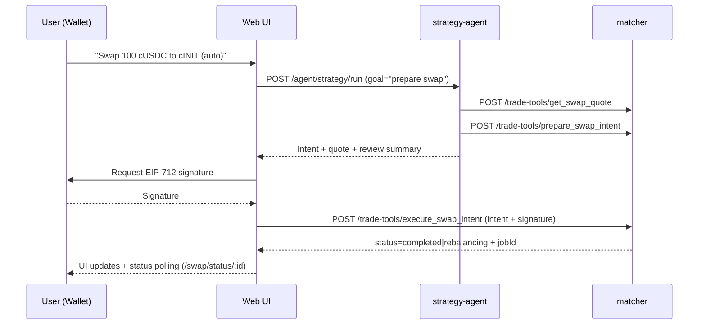

# Agent: current behavior, tooling, and a roadmap to execute trades in DarkVault

This document explains **how the agent works today** in this repo (which services it touches, which tools it has available, and how it orchestrates them), and proposes a **concrete roadmap** to let the agent **execute trades inside the platform (DarkVault / matcher)** with guardrails, authorization, and observability.

> Current state: the existing agent is focused on **building/validating/backtesting strategies**. **Execution** (orders and swaps) exists in the `matcher` and in the UI, but **is not exposed as agent “tools”** and does not yet have an authorization model suitable for autonomous execution.

## 1) Where the “agent” lives and how it acts

### Services and responsibilities (as-is)

- `services/strategy-agent/`:
  - Fastify API for agent sessions and the agent runtime.
  - Main endpoints:
    - `GET /agent/health`
    - `GET /agent/capabilities`
    - `GET /agent/sessions` / `GET /agent/sessions/:sessionId`
    - `POST /agent/strategy/plan`
    - `POST /agent/strategy/run` and `POST /agent/strategy/run/stream`
  - Entry point: `services/strategy-agent/src/index.ts`.

- `services/matcher/`:
  - Off-chain execution engine (matching, router, vault sync, etc.).
  - Exposes “strategy tools” that the agent can call:
    - `GET /strategy-tools/catalog`
    - `POST /strategy-tools/:tool`
  - Entry point: `services/matcher/src/index.ts`.

- `packages/shared/`:
  - Defines the tools contract (Zod schemas + tool catalog + HTTP transport).
  - Today: `packages/shared/src/strategyTools.ts` defines `strategyToolDefinitions`, `strategyToolInputSchemas`, and `createHttpStrategyToolTransport(...)`.

- `apps/web/`:
  - UI for agentic mode (Strategy Studio).
  - Key component: `apps/web/src/components/StrategyAgentPanel.tsx` calls the agent API (`/agent/*`) and renders trace/outputs.

### Agent tooling (as-is)

The agent can only use strategy tools defined in `@sinergy/shared`:

- Discovery: `list_strategy_capabilities`, `analyze_market_context`, `list_strategy_templates`, `list_user_strategies`, `get_strategy`
- Mutations: `create_strategy_draft`, `update_strategy_draft`, `save_strategy`, `clone_strategy_template`
- Verification/terminal: `validate_strategy_draft`, `run_strategy_backtest`, `get_backtest_summary`, `get_backtest_trades`, `get_backtest_chart_overlay`

Tool execution actually happens against the matcher:

- HTTP transport: `createHttpStrategyToolTransport(...)` (shared) calls `POST /strategy-tools/:tool`.
- In the matcher, `services/matcher/src/services/strategyToolApi.ts` validates input (Zod), rate-limits per owner, and executes via `StrategyService`.
- Error/meta wrapper: `services/matcher/src/services/strategyToolSecurity.ts`.

### Agent runtime: native tool-calling vs fallback

`services/strategy-agent` is designed to work with models that:

1) support tool-calling (via LangChain), or
2) **do not** support tool-calling: it uses a **fallback planner** that forces the model to return JSON and the server invokes the tool.

Relevant pieces:

- Main prompt and workflow rules: `services/strategy-agent/src/prompts.ts`.
- Tool catalog + wrapping (with trace): `services/strategy-agent/src/services/matcherTools.ts`.
- Runtime policies / metrics / stall detection: `services/strategy-agent/src/services/runtimePolicy.ts`.
- Fallback loop (JSON planner): `services/strategy-agent/src/services/fallbackRuntime.ts`.

## 2) What already exists today for “trading” (but outside the agent)

The matcher already exposes execution endpoints that the UI uses directly:

- Orders:
  - `GET /orders/:address`
  - `POST /orders`
  - `POST /orders/:id/cancel`
- Router swaps:
  - `POST /swap/quote`
  - `POST /swap/execute`
  - `GET /swap/status/:id`

References:
- `services/matcher/src/index.ts` (routes).
- Swap UI: `apps/web/src/components/SwapPanel.tsx`.

Important limitation (as-is):
- These endpoints accept `userAddress` in the request body, but **do not verify a signature** or an authorization token per request. That’s fine for a local demo, but **not sufficient** to enable agent-driven autonomous execution.

## 3) Gap: why the agent “doesn’t trade” today

1) There are no agent tools for trading (orders/swaps). The tool catalog (`strategyToolDefinitions`) is limited to strategy building/backtesting.
2) There is no robust authorization/consent model for an agent to execute actions with funds:
   - missing an intent-signing layer (e.g., EIP-712) and server-side verification,
   - missing a human-in-the-loop (HITL) or constrained delegation mechanism.
3) There is no execution-specific policy layer (risk limits, slippage caps, allowlists) applied to trading actions.
4) Execution observability/auditing is not integrated into the agent loop (beyond the trace for strategy tools).

## 4) Proposed roadmap: safely executing trades inside DarkVault (matcher)

### Design principles

- The agent service **must not** custody private keys or “sign as the user”.
- Execution must be **deterministic and auditable**: what gets executed must be bounded by a verifiable artifact (intent/quote/nonce/expiry).
- Explicitly separate:
  - **Read tools** (state/balances/quotes),
  - **Preparation tools** (drafts / intents),
  - **Execution tools** (require approval or valid delegation).

### Phase 0 — Align “as-is” vs “aspirational” contract (1–2 days)

- Clearly document what is implemented vs not (e.g., `docs/architecture.md` mentions EIP-712 approval, but current code does not verify signatures on `/swap/*` or `/orders`).
- Define the “minimum safe” execution mode:
  - Mode 1: **human-in-the-loop** (recommended for the first release).
  - Mode 2: **constrained delegation** (session key / allowance / policies), later.

### Phase 1 — Create a “Trade Tools” system parallel to “Strategy Tools” (3–6 days)

Create a module equivalent to `strategyTools` but for execution, e.g.:

- `packages/shared/src/tradeTools.ts`
  - `tradeToolInputSchemas` (strict Zod)
  - `tradeToolDefinitions` (catalog + descriptions)
  - `createHttpTradeToolTransport(...)`
  - `createLangChainCompatibleTradeTools(...)`

Suggested tools (minimum viable):

- Read:
  - `get_balances` (or `get_internal_balances`): mirror of `GET /balances/:address`.
  - `list_open_orders`: mirror of `GET /orders/:address`.
  - `get_swap_quote`: wrapper of `POST /swap/quote`.
  - `get_swap_status`: wrapper of `GET /swap/status/:id`.
- Preparation/execution (with guardrails):
  - `prepare_swap_intent` → returns quote + parameters and an `intentHash`.
  - `execute_swap_intent` → requires `intent` + `signature` (HITL) or a `delegationToken` (delegated mode).
  - `place_limit_order_intent` / `cancel_order_intent` in the same pattern.

### Phase 2 — Expose `/trade-tools/*` in the matcher with consistent security (3–6 days)

In `services/matcher`:

- Add:
  - `services/matcher/src/services/tradeToolApi.ts` (tool switch + validation)
  - `services/matcher/src/services/tradeToolSecurity.ts` (meta + errors + rate limit)
  - Endpoints:
    - `GET /trade-tools/catalog`
    - `POST /trade-tools/:tool`

Incremental implementation:

- Initially, trade-tools can delegate to existing functions:
  - `liquidityRouter.quote(...)`, `liquidityRouter.execute(...)`
  - `matchingService.placeOrder(...)`, `matchingService.cancelOrder(...)`
- Keep `/swap/*` and `/orders*` for legacy UI, but steer the roadmap so “real” execution flows through trade-tools (with policy + auth).

### Phase 3 — Authorization: signed intents (HITL) and server-side verification (4–10 days)

Recommended model for the first release:

- The agent only produces an **intent** (does not execute).
- The UI shows “Review & Approve” and the user signs (EIP-712).
- The matcher verifies signature + nonce + expiry and only then executes.

Suggested intent design (swap example):

- Typical fields:
  - `owner` (address), `marketId`, `fromToken`, `amountIn`, `minOut`, `routePreference`
  - `expiry`, `nonce`, `chainId`, `matcherDomain`
  - optional: `maxSlippageBps`, `maxPriceImpactBps`, `maxNotionalQuote`

Required changes:

- Add signature verification to the execution layer (ideally inside `/trade-tools/execute_*`).
- Persist per-owner nonce / anti-replay state in the DB.

### Phase 4 — Guardrails/risk and a “policy engine” (3–8 days)

Apply guardrails both:

- server-side (matcher): the source of truth for limits, allowlists, and checks, and
- agent-side (strategy-agent runtime): prevent the model from skipping steps or executing without confirmation.

Minimum checklist:

- Allowlist `marketId` and allowed tokens.
- Per-owner limits: max notional per trade/day, max slippage, cooldown per tool.
- Balance checks (internal/vault) before preparing or executing.
- For swaps: always require `minOut` and `expiry`; for orders: require a reasonable limit price (or prohibit market orders initially).

### Phase 5 — Integrate into `strategy-agent`: mixed catalog + UX (3–7 days)

Options:

1) Extend the current `strategy-agent` to support **two catalogs**:
   - `strategyTools` (build/backtest)
   - `tradeTools` (read/execute)
2) Create a separate service (`trade-agent`) and keep responsibilities separate.

To reduce initial complexity, option (1) is usually enough:

- Expose both catalogs in `/agent/capabilities` plus a `tradingEnabled` flag.
- Add an “Execution” mode in the UI where:
  - the agent can quote and prepare intents,
  - but execution requires confirmation + signature.

### Phase 6 — Observability, auditing, and tests (ongoing)

- Persist in `agent-sessions.sqlite`:
  - generated intents,
  - approvals (hash/signature),
  - executions (orderId/jobId/txHash as applicable).
- Tests:
  - schema unit tests (`packages/shared`),
  - API tests (`services/matcher`) for `/trade-tools/*`,
  - runtime tests (simulate decisions and verify it can’t execute without approval).

## 5) Recommended (HITL) sequence for an agentic swap

## 6) Concrete roadmap deliverables (ticket-ready)

- `packages/shared`:
  - New `tradeTools.ts` + public exports.
- `services/matcher`:
  - New endpoints `/trade-tools/catalog` and `/trade-tools/:tool`.
  - Signature verification in execution tools (at minimum for swaps).
- `services/strategy-agent`:
  - Trade tool catalog support + a “never execute without approval” policy.
- `apps/web`:
  - Intent review/approve UI.
  - Job visualization (swap rebalancing) inside the agent thread.
