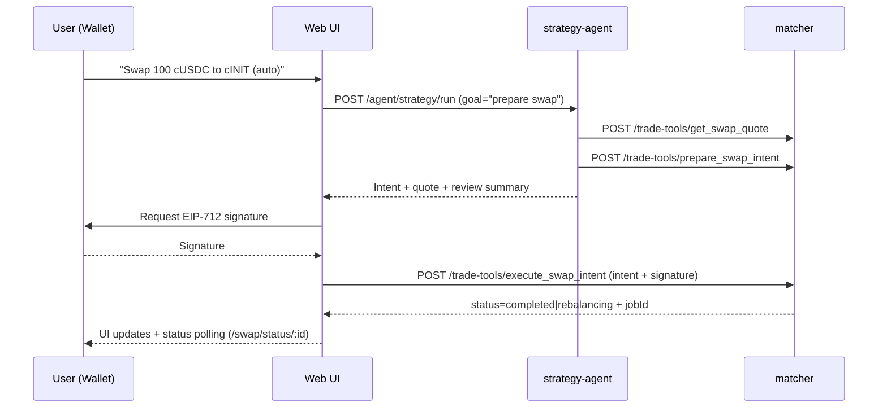

# Agent: comportamiento actual, tooling y roadmap para ejecutar trades en DarkVault

Este documento aterriza **cómo funciona hoy el agente** en este repo (qué servicios toca, qué herramientas tiene disponibles y cómo se orquesta), y propone un **roadmap concreto** para que el agente pueda **ejecutar trades dentro de la plataforma (DarkVault / matcher)** con guardrails, autorización y observabilidad.

> Estado a la fecha: el agente existente está enfocado en **construcción/validación/backtesting de estrategias**. La **ejecución** (órdenes y swaps) existe en el `matcher` y en la UI, pero **no está expuesta como “tools” del agente** ni tiene un modelo de autorización apto para ejecución autónoma.

## 1) Dónde vive “el agente” y cómo actúa

### Servicios y responsabilidades (as-is)

- `services/strategy-agent/`:
  - API Fastify para “agent sessions” y ejecución del runtime del agente.
  - Endpoints principales:
    - `GET /agent/health`
    - `GET /agent/capabilities`
    - `GET /agent/sessions` / `GET /agent/sessions/:sessionId`
    - `POST /agent/strategy/plan`
    - `POST /agent/strategy/run` y `POST /agent/strategy/run/stream`
  - Archivo de entrada: `services/strategy-agent/src/index.ts`.

- `services/matcher/`:
  - Motor de ejecución off-chain (matching, router, vault sync, etc.).
  - Exposición de “strategy tools” consumibles por el agente:
    - `GET /strategy-tools/catalog`
    - `POST /strategy-tools/:tool`
  - Archivo de entrada: `services/matcher/src/index.ts`.

- `packages/shared/`:
  - Define el contrato de herramientas (schemas Zod + catálogo + transport HTTP).
  - Hoy: `packages/shared/src/strategyTools.ts` define `strategyToolDefinitions`, `strategyToolInputSchemas` y `createHttpStrategyToolTransport(...)`.

- `apps/web/`:
  - UI para el modo agentic (Strategy Studio).
  - Componente clave: `apps/web/src/components/StrategyAgentPanel.tsx` consume el API del agente (`/agent/*`) y renderiza trace/outputs.

### Tooling del agente (as-is)

El agente sólo puede usar herramientas de estrategia definidas en `@sinergy/shared`:

- Discovery: `list_strategy_capabilities`, `analyze_market_context`, `list_strategy_templates`, `list_user_strategies`, `get_strategy`
- Mutations: `create_strategy_draft`, `update_strategy_draft`, `save_strategy`, `clone_strategy_template`
- Verification/terminal: `validate_strategy_draft`, `run_strategy_backtest`, `get_backtest_summary`, `get_backtest_trades`, `get_backtest_chart_overlay`

La ejecución real del tool-call sucede contra el matcher:

- Transporte HTTP: `createHttpStrategyToolTransport(...)` (shared) llama `POST /strategy-tools/:tool`.
- En el matcher, `services/matcher/src/services/strategyToolApi.ts` valida input (Zod), rate-limitea por owner y ejecuta via `StrategyService`.
- Envoltorio de errores/meta: `services/matcher/src/services/strategyToolSecurity.ts`.

### Runtime del agente: tool-calling nativo vs fallback

`services/strategy-agent` está diseñado para operar con modelos que:

1) soportan tool-calling (vía LangChain), o
2) **no** soportan tool-calling: usa un **fallback planner** que obliga al modelo a devolver JSON y el servidor invoca la herramienta.

Piezas relevantes:

- Prompt principal y reglas del workflow: `services/strategy-agent/src/prompts.ts`.
- Catálogo y wrapping de tools (con trace): `services/strategy-agent/src/services/matcherTools.ts`.
- Políticas de runtime / métricas / stall detection: `services/strategy-agent/src/services/runtimePolicy.ts`.
- Fallback loop (JSON planner): `services/strategy-agent/src/services/fallbackRuntime.ts`.

## 2) Qué sí existe hoy para “trading” (pero fuera del agente)

En el matcher ya existen endpoints de ejecución que la UI usa directamente:

- Órdenes:
  - `GET /orders/:address`
  - `POST /orders`
  - `POST /orders/:id/cancel`
- Router swaps:
  - `POST /swap/quote`
  - `POST /swap/execute`
  - `GET /swap/status/:id`

Referencias:
- `services/matcher/src/index.ts` (rutas).
- UI de swaps: `apps/web/src/components/SwapPanel.tsx`.

Limitación importante (as-is):
- Estos endpoints toman `userAddress` en el body, pero **no validan una firma** ni un token de autorización por request. Esto es aceptable para un demo local, pero **no es suficiente** para habilitar ejecución autónoma desde un agente.

## 3) Gap: por qué el agente “no hace trades” hoy

1) No existen “agent tools” para trading (órdenes/swaps). El catálogo de tools (`strategyToolDefinitions`) está limitado a estrategias/backtesting.
2) No hay un modelo robusto de autorización/consentimiento para que un agente ejecute acciones con fondos:
   - falta una capa de “intent signing” (por ejemplo EIP-712) y verificación server-side,
   - falta un mecanismo de “human-in-the-loop” o delegación acotada.
3) No hay un policy layer específico de ejecución (riesgo, límites, slippage, allowlists) aplicado a herramientas de trading.
4) Observabilidad/auditoría de ejecuciones no está integrada al loop del agente (más allá del trace de strategy tools).

## 4) Roadmap propuesto: ejecutar trades dentro de DarkVault (matcher) de forma segura

### Principios de diseño

- El servicio del agente **no debe** custodiar llaves privadas ni “firmar por el usuario”.
- La ejecución debe ser **determinista y auditable**: lo que se ejecuta debe estar acotado por un artefacto verificable (intento/quote/nonce/expiry).
- Separar explícitamente:
  - **Tools de lectura** (estado/balances/quotes),
  - **Tools de preparación** (borradores / intents),
  - **Tools de ejecución** (requieren aprobación o delegación válida).

### Fase 0 — Alinear contrato “as-is” vs “aspiracional” (1–2 días)

- Documentar claramente qué está implementado y qué no (por ejemplo, `docs/architecture.md` menciona aprobación EIP-712, pero en el código actual no hay verificación de firmas en `/swap/*` o `/orders`).
- Definir el “mínimo seguro” para ejecución:
  - Modo 1: **human-in-the-loop** (recomendado para el primer release).
  - Modo 2: **delegación acotada** (session key / allowance / policies), posterior.

### Fase 1 — Crear un sistema de “Trade Tools” paralelo a “Strategy Tools” (3–6 días)

Crear un módulo equivalente a `strategyTools` pero para ejecución, p.ej.:

- `packages/shared/src/tradeTools.ts`
  - `tradeToolInputSchemas` (Zod strict)
  - `tradeToolDefinitions` (catálogo + descripciones)
  - `createHttpTradeToolTransport(...)`
  - `createLangChainCompatibleTradeTools(...)`

Tools sugeridas (mínimo viable):

- Lectura:
  - `get_balances` (o `get_internal_balances`): mirror de `GET /balances/:address`.
  - `list_open_orders`: mirror de `GET /orders/:address`.
  - `get_swap_quote`: wrapper de `POST /swap/quote`.
  - `get_swap_status`: wrapper de `GET /swap/status/:id`.
- Preparación/ejecución (con guardrails):
  - `prepare_swap_intent` → devuelve quote + parámetros y un `intentHash`.
  - `execute_swap_intent` → requiere `intent` + `signature` (modo HITL) o `delegationToken` (modo delegado).
  - `place_limit_order_intent` / `cancel_order_intent` en el mismo patrón.

### Fase 2 — Exponer `/trade-tools/*` en el matcher con seguridad consistente (3–6 días)

En `services/matcher`:

- Agregar:
  - `services/matcher/src/services/tradeToolApi.ts` (switch por tool + validación)
  - `services/matcher/src/services/tradeToolSecurity.ts` (meta + errores + rate limit)
  - Endpoints:
    - `GET /trade-tools/catalog`
    - `POST /trade-tools/:tool`

Implementación incremental:

- Inicialmente, los trade-tools pueden delegar a las funciones ya existentes:
  - `liquidityRouter.quote(...)`, `liquidityRouter.execute(...)`
  - `matchingService.placeOrder(...)`, `matchingService.cancelOrder(...)`
- Mantener `/swap/*` y `/orders*` para UI legacy, pero dirigir el roadmap a que la ejecución “real” pase por trade-tools (con policy + auth).

### Fase 3 — Autorización: intents firmados (HITL) y verificación server-side (4–10 días)

Modelo recomendado para el primer release:

- El agente sólo produce un **intent** (no ejecuta).
- La UI muestra un “Review & Approve” y el usuario firma (EIP-712).
- El matcher valida firma + nonce + expiry y recién ahí ejecuta.

Diseño sugerido del intent (ejemplo swap):

- Campos típicos:
  - `owner` (address), `marketId`, `fromToken`, `amountIn`, `minOut`, `routePreference`
  - `expiry`, `nonce`, `chainId`, `matcherDomain`
  - opcional: `maxSlippageBps`, `maxPriceImpactBps`, `maxNotionalQuote`

Cambios requeridos:

- Agregar verificación de firma a la capa de ejecución (idealmente dentro de `/trade-tools/execute_*`).
- Persistir nonce/anti-replay por `owner` en DB.

### Fase 4 — Guardrails/riesgo y “policy engine” (3–8 días)

Aplicar guardrails tanto:

- server-side (matcher): fuente de verdad para límites, allowlists y checks, y
- agent-side (strategy-agent runtime): evitar que el modelo “salte” pasos o llame ejecución sin confirmación.

Checklist mínima:

- Allowlist de `marketId` y tokens permitidos.
- Límites por owner: notional máximo por trade/día, slippage máximo, cooldown por tool.
- Validación de balances (internos/vault) antes de preparar o ejecutar.
- En swaps: exigir `minOut` y `expiry` siempre; en órdenes: exigir limitPrice razonable (o prohibir market orders al inicio).

### Fase 5 — Integración en `strategy-agent`: catálogo mixto y UX (3–7 días)

Opciones:

1) Extender el `strategy-agent` actual para soportar **dos catálogos**:
   - `strategyTools` (construcción/backtest)
   - `tradeTools` (lectura/ejecución)
2) Crear un servicio separado (`trade-agent`) y mantener responsabilidades separadas.

Para reducir complejidad inicial, la opción (1) suele ser suficiente:

- Exponer en `/agent/capabilities` ambos catálogos y un flag `tradingEnabled`.
- Agregar a la UI un modo “Execution” donde:
  - el agente puede cotizar y preparar intents,
  - pero ejecutar requiere confirmación + firma.

### Fase 6 — Observabilidad, auditoría y tests (continuo)

- Persistir en `agent-sessions.sqlite`:
  - intents generados,
  - approvals (hash/firma),
  - ejecuciones (orderId/jobId/txHash si aplica).
- Tests:
  - unit tests de schemas (`packages/shared`),
  - tests de API (`services/matcher`) para `/trade-tools/*`,
  - tests del runtime (simular decisiones y verificar que no ejecute sin aprobación).

## 5) Secuencia recomendada (HITL) para un swap “agentic”

## 6) Entregables concretos del roadmap (para tickets)

- `packages/shared`:
  - Nuevo `tradeTools.ts` + exports públicos.
- `services/matcher`:
  - Nuevos endpoints `/trade-tools/catalog` y `/trade-tools/:tool`.
  - Verificación de firma en tools de ejecución (mínimo para swaps).
- `services/strategy-agent`:
  - Soporte de catálogo de trade tools + policy de “no ejecutar sin approval”.
- `apps/web`:
  - UI de review/approve para intents.
  - Visualización de jobs (swap rebalancing) dentro del hilo del agente.

