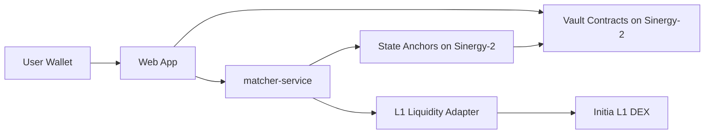
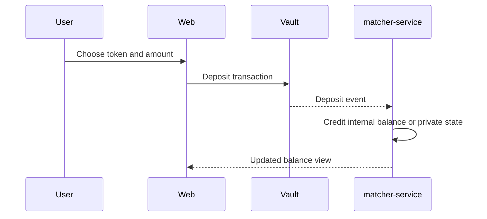
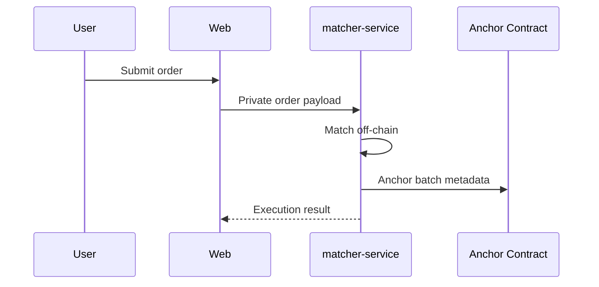
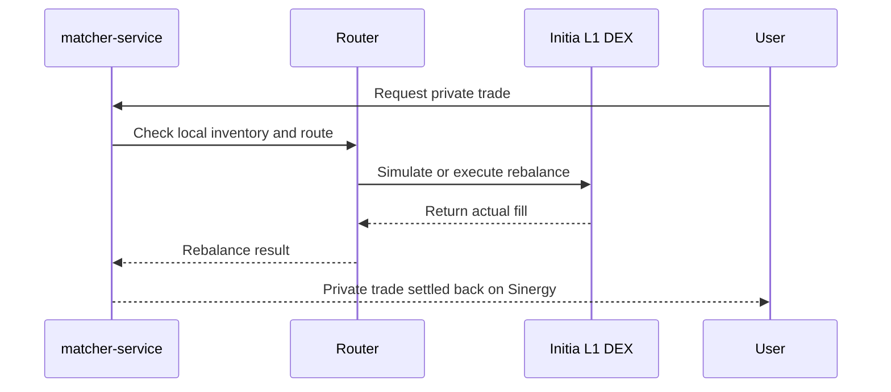
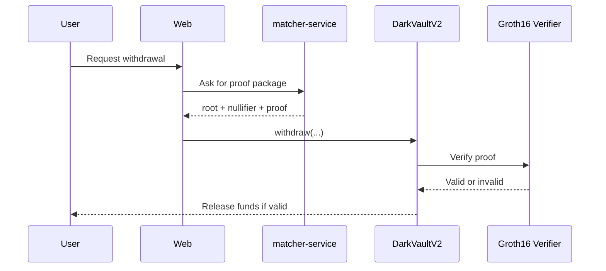

# Sinergy Privacy Architecture

## Objective

Explain the architecture of `Sinergy` and describe how privacy works in the project today, what is already protected, what is still exposed, and how the system is evolving toward stronger confidentiality.

This document is intentionally more explanatory than [privacy-engine-design.md](./privacy-engine-design.md). That design doc is the implementation blueprint. This document is the architectural overview.

## One-Sentence Summary

`Sinergy` is a private trading system on `Sinergy-2` where custody and verification live on-chain, while order flow, matching, and most sensitive market logic live off-chain, with `Initia L1` used as an external liquidity source.

## System Overview

At a high level, the project has four layers:

1. `Sinergy-2` `MiniEVM`
   Holds custody, settlement contracts, roots, and withdrawal verification.
2. `matcher-service`
   Runs the private trading logic, balance tracking, and router coordination.
3. `web`
   User interface for deposits, orders, swaps, and withdrawals.
4. `Initia L1`
   External liquidity source for routed markets through `Initia DEX`.

## Core Architectural Idea

The architecture separates:

- `public settlement`
  What must be verifiable and enforceable on-chain.
- `private execution`
  What should not be broadcast publicly to the market.

This separation is what gives the project its privacy profile.

Instead of placing the order book and matching directly on-chain, `Sinergy` keeps that logic off-chain and only anchors the minimum necessary state on-chain.

## High-Level Diagram

## Main Components

### 1. Frontend

The frontend in `apps/web` is responsible for:

- wallet connection;
- deposit and withdrawal UX;
- private order submission;
- router and portfolio views;
- switching between legacy and ZK vault flow when the deployment exposes the new contracts.

Relevant files:

- [App.tsx](../apps/web/src/App.tsx)
- [VaultPanel.tsx](../apps/web/src/components/VaultPanel.tsx)
- [PortfolioView.tsx](../apps/web/src/components/PortfolioView.tsx)

### 2. Matcher Service

The matcher is the operational brain of the protocol.

It handles:

- internal balances;
- private orders;
- price-time matching;
- deposit and withdrawal synchronization;
- router decisions;
- external liquidity rebalancing;
- ZK withdrawal package serving in the current transition phase.

Relevant files:

- [index.ts](../services/matcher/src/index.ts)
- [vault.ts](../services/matcher/src/services/vault.ts)
- [router.ts](../services/matcher/src/services/router.ts)
- [initiaDex.ts](../services/matcher/src/services/initiaDex.ts)
- [zkProofs.ts](../services/matcher/src/services/zkProofs.ts)

### 3. On-Chain Contracts

`Sinergy-2` holds the contracts that define custody and verifiability.

There are now two logical generations in the repo:

- `legacy flow`
  `DarkPoolVault` plus backend-signed withdrawals.
- `privacy-upgrade flow`
  `DarkVaultV2`, `DarkStateAnchor`, and `Groth16WithdrawalVerifier`.

Relevant files:

- [DarkPoolVault.sol](../contracts/src/DarkPoolVault.sol)
- [DarkPoolMarket.sol](../contracts/src/DarkPoolMarket.sol)
- [DarkVaultV2.sol](../contracts/src/DarkVaultV2.sol)
- [DarkStateAnchor.sol](../contracts/src/DarkStateAnchor.sol)
- [Groth16WithdrawalVerifier.sol](../contracts/src/Groth16WithdrawalVerifier.sol)

### 4. Initia L1 Liquidity Layer

`Initia L1` is not where private execution happens. It is where external liquidity is sourced when local inventory is insufficient or when the user explicitly wants routed execution.

Relevant doc:

- [initia-dex-liquidity-routing.md](./initia-dex-liquidity-routing.md)

## How Privacy Works

Privacy in `Sinergy` is not one single thing. It is a stack of protections.

### Layer 1: Off-Chain Order Flow

The first privacy layer is architectural.

Orders are not posted to a public on-chain order book. They are submitted to the private backend and matched off-chain.

This means:

- other traders cannot inspect open intent on-chain;
- frontrunning based on public order submission is reduced;
- trade negotiation is hidden from the public chain.

### Layer 2: Minimal On-Chain Footprint

Only a limited set of actions are visible on-chain:

- deposits;
- withdrawals;
- batch anchors;
- settlement metadata;
- router-side inventory movements where needed.

The market does not see every open order, every partial fill, or every order amendment.

### Layer 3: State Commitments

The privacy architecture is moving from:

- backend-only balance authority

to:

- private state committed as roots on-chain.

Instead of exposing raw per-user balances, the chain can store only:

- `stateRoot`
- `batchHash`
- `settlementRoot`
- `nullifiers`

This makes the system more private and more verifiable at the same time.

### Layer 4: Proof-Backed Withdrawals

In the upgraded flow, withdrawals are no longer justified only by a trusted backend signature.

Instead, the user presents:

- a committed `root`;
- a `nullifier`;
- a proof that the withdrawal claim is valid.

This changes the trust model materially, because the chain can reject an invalid exit even if a backend service is buggy or compromised.

## Privacy Today vs Privacy Target

### Privacy Today

What the system already protects:

- the order book is not public on-chain;
- user intent is not broadcast to the whole market;
- matching logic is not executed publicly on-chain;
- public visibility is concentrated in custody and settlement events.

What is still exposed or trusted:

- the backend can still see order flow in plaintext;
- internal balances are still operationally coordinated by the backend;
- the current ZK integration is real for withdrawal proof flow, but backend generation is not yet fully dynamic from production note state;
- routed liquidity on `Initia L1` is not private by itself.

### Privacy Target

The target state is stronger:

- encrypted order flow;
- committed private state on-chain;
- proof-backed or attested exits;
- more auditable state transitions;
- eventually stronger confidential settlement guarantees.

## Trust Model

The project is improving privacy by reducing unnecessary trust step by step.

### Legacy Trust Model

The user had to trust:

1. the matcher to maintain correct balances;
2. the backend signer to authorize fair withdrawals;
3. the operator not to misuse privileged visibility.

### Transitional Trust Model

With the newer privacy components, the model becomes:

1. the matcher still coordinates private state;
2. on-chain roots and nullifiers reduce arbitrary backend authority;
3. a withdrawal proof can be checked independently by the chain;
4. the backend becomes more of an orchestrator than an unquestioned authority.

### Long-Term Trust Model

The intended long-term direction is:

1. private state transitions anchored on-chain;
2. stronger proof systems for exits and settlement;
3. less reliance on backend trust for correctness;
4. stronger privacy against both public observers and operators.

## Current Privacy Flows

### Deposit Flow

Deposits are public on-chain, but the internal private crediting logic remains off-chain.

Privacy effect:

- the market sees that a deposit happened;
- the market does not see the user’s order intent or matching strategy.

### Private Trading Flow

Privacy effect:

- the public chain does not hold the order book;
- the batch can be anchored without revealing every individual order.

### Routed Liquidity Flow

Privacy effect:

- the user trades through the private system;
- `Initia L1` is used as liquidity infrastructure, not as the public order book for the user.

### ZK Withdrawal Flow

Privacy effect:

- the chain verifies correctness without needing the raw private note;
- the nullifier prevents double-withdrawal;
- the exit is more private and more trust-minimized than a signed ticket flow.

## What Is Public and What Is Private

### Public

- contract addresses;
- deposits and withdrawals;
- token transfers;
- batch anchors and state roots;
- routed liquidity activity that touches `Initia L1`.

### Private

- open orders;
- order timing before settlement;
- matching logic;
- internal ledger interpretation;
- private note inputs used to produce a valid withdrawal proof.

## Limits of Privacy

It is important to be honest about what the system does not yet hide.

### Not Hidden Yet

- user custody interactions are still visible on-chain;
- the operator still has visibility into current private coordination flows;
- `Initia L1` liquidity actions are not magically shielded;
- the current proof flow is focused on withdrawal validation, not full private settlement of every state transition.

### Why That Is Still Valuable

Even with those limits, the architecture is already stronger than a simple public on-chain order book because it:

- hides market intent;
- reduces public exposure of trading logic;
- concentrates visibility into settlement checkpoints instead of exposing every trading action;
- provides a path toward stronger trust minimization.

## Why `MiniEVM` Is Useful for Privacy

`MiniEVM` is useful not because it is confidential by default, but because it is a good settlement environment for privacy-preserving architecture.

It gives the project:

- EVM-compatible contract logic;
- compatibility with standard wallet tooling;
- a place to verify proofs and track nullifiers;
- a clean separation from `Initia L1`, which can remain the liquidity venue.

## Why `Initia L1` Is Useful

`Initia L1` gives the project:

- external liquidity access;
- canonical assets and DEX execution;
- a way to source depth without moving the private order book there.

That separation is one of the core architectural strengths of `Sinergy`.

## Architectural Evolution

The privacy roadmap is cumulative.

### Phase 1

- off-chain order flow;
- on-chain custody;
- signed withdrawals;
- minimal public footprint.

### Phase 2

- state anchoring;
- nullifiers;
- ZK withdrawal flow;
- dual support for legacy and upgraded vault flow.

### Phase 3

- stronger private state generation in backend;
- dynamic proof generation from real notes and Merkle paths;
- tighter integration between matching engine and committed private state.

### Phase 4

- broader proof-backed settlement;
- less operational trust in backend authority;
- stronger confidentiality around state transitions.

## Recommended Reading Order

If someone wants to understand the project quickly, the best reading order is:

1. [architecture.md](./architecture.md)
2. [privacy-architecture.md](./privacy-architecture.md)
3. [privacy-engine-design.md](./privacy-engine-design.md)
4. [initia-dex-liquidity-routing.md](./initia-dex-liquidity-routing.md)
5. [zk-withdrawal-runbook.md](./zk-withdrawal-runbook.md)

## Relevant Source Files

- [deployments/testnet.json](../deployments/testnet.json)
- [DarkPoolVault.sol](../contracts/src/DarkPoolVault.sol)
- [DarkVaultV2.sol](../contracts/src/DarkVaultV2.sol)
- [DarkStateAnchor.sol](../contracts/src/DarkStateAnchor.sol)
- [Groth16WithdrawalVerifier.sol](../contracts/src/Groth16WithdrawalVerifier.sol)
- [VaultPanel.tsx](../apps/web/src/components/VaultPanel.tsx)
- [vault.ts](../services/matcher/src/services/vault.ts)
- [router.ts](../services/matcher/src/services/router.ts)
- [initiaDex.ts](../services/matcher/src/services/initiaDex.ts)
