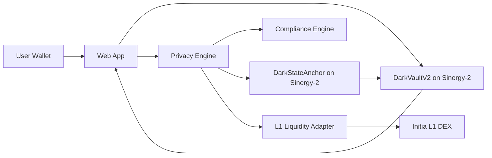
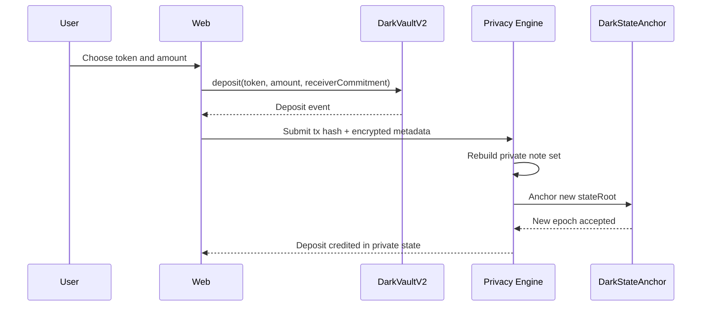
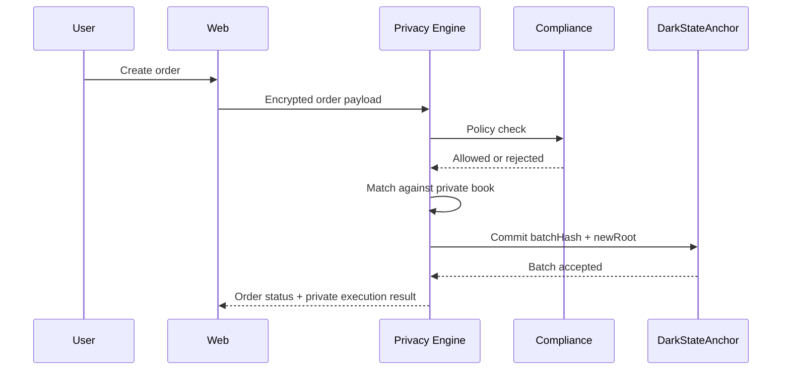
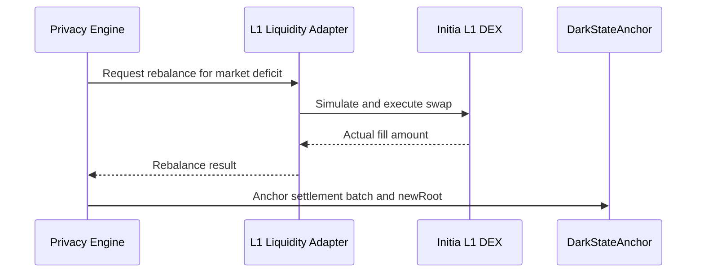
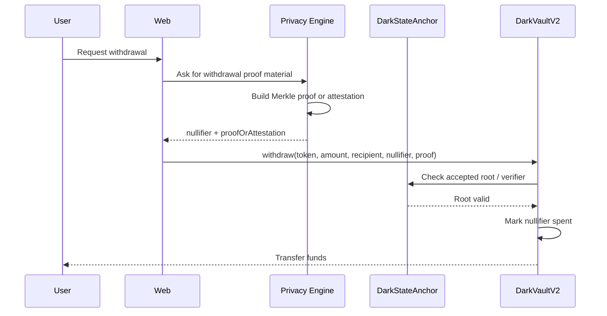

# Sinergy Privacy Engine Design

## In Simple Terms

This document describes where `Sinergy` wants to evolve so it depends less on backend trust and can support withdrawals and settlement with verifiable proofs. It is more technical than the other docs because it serves as a design guide.

## When To Read This Document

Read this once you already understand the general architecture and want to review the target version of the privacy engine, its components, and its trade-offs.

## What To Remember

- This document describes the target state, not only the current system.
- The goal is for the backend to stop being the only source of truth for balances and withdrawals.
- `Initia L1` remains the external liquidity source, not the place where privacy lives.

## Objective

Design a privacy-preserving settlement architecture for `Sinergy-2` on Initia `MiniEVM`, while keeping `Initia L1` as the external liquidity source.

This document upgrades the current model:

- custody on-chain in `DarkPoolVault`
- private order flow off-chain in `matcher-service`
- router-assisted liquidity from `Initia L1`

Into a stronger model where:

- the backend is no longer the only source of truth for private balances;
- private state is anchored on `Sinergy-2`;
- withdrawals are authorized by verifiable state, not only by backend signatures;
- `Initia L1` continues to provide external liquidity through the existing router path.

## Current State

Today the system already has three useful building blocks:

1. `Sinergy-2` `MiniEVM` rollup running on testnet and configured in [deployments/testnet.json](../deployments/testnet.json)
2. `DarkPoolVault` for on-chain custody in [DarkPoolVault.sol](../contracts/src/DarkPoolVault.sol)
3. `Initia L1` liquidity routing in [initia-dex-liquidity-routing.md](./initia-dex-liquidity-routing.md)

Current trust assumptions are still strong:

- the backend maintains the private ledger in memory / local state;
- the backend signs withdrawals directly;
- the backend can see orders and balances in plaintext;
- the user cannot independently verify the internal private state from the chain alone.

## Design Principles

1. `Sinergy-2` should be the settlement and verification layer for private trading.
2. `Initia L1` should remain the liquidity layer, not the private execution layer.
3. The privacy engine should run off-chain, but its outputs should be anchored on-chain.
4. The user should be able to withdraw against committed state, not only backend trust.
5. The first production step should prefer `TEE / confidential compute` over full `ZK`, then evolve toward stronger proofs later.

## Why `MiniEVM` Still Helps

`MiniEVM` does not provide privacy by itself, but it is still the right place to:

- hold custody;
- store state roots;
- register nullifiers;
- enforce challenge windows and settlement rules;
- verify attester signatures or proof outputs;
- expose minimal auditability without leaking the full order book.

This means `Sinergy-2` becomes the public settlement shell around a private execution engine.

## Target Architecture

### High-Level Roles

| Layer | Role |
|---|---|
| `Sinergy-2` `MiniEVM` | custody, state anchoring, withdrawal validation, batch settlement |
| Privacy Engine | encrypted orders, matching, compliance, confidential state transitions |
| `Initia L1` | external liquidity, DEX rebalance, canonical asset source |
| Frontend | deposit, encrypted order submission, proof-backed withdrawals |

### Components

1. `DarkVaultV2`
   On-chain custody contract for deposits, withdrawals, nullifiers, and settlement authorization.
2. `DarkStateAnchor`
   On-chain registry of private ledger roots and batch metadata.
3. `Privacy Engine`
   Off-chain confidential service that manages encrypted orders and computes new private state.
4. `Compliance / Policy Engine`
   Optional off-chain or attested module that approves or blocks accounts, assets, or actions.
5. `L1 Liquidity Adapter`
   Existing router path that simulates and executes swaps on `Initia L1`.
6. `Proof / Attestation Gateway`
   Produces either:
   - TEE attestation plus signed batch commitment
   - Merkle inclusion proof for withdrawals
   - ZK proof in later phases

## Architecture Diagram



## Core State Model

The private ledger moves from backend-owned balance maps to a committed state model.

### Private State

Each user balance or claim is represented off-chain as a note-like record:

- `ownerCommitment`
- `token`
- `amount`
- `blinding`
- `epoch`

These records are not published directly. Instead, the system publishes:

- `stateRoot`
- `batchHash`
- `settlementRoot` or equivalent batch digest
- `nullifiers` for spent withdrawal claims

### Public On-Chain State

The chain stores only the minimum data required for verification:

- latest accepted `stateRoot`
- batch sequence number
- attester / verifier registry
- withdrawal nullifiers
- optional challenge deadline
- vault reserve balances

## Contract Design

### 1. `DarkVaultV2`

Responsibilities:

- receive deposits from supported ERC20s;
- link deposits to a private balance commitment flow;
- release funds only if a withdrawal proof or attestation is valid;
- prevent double-withdrawal with nullifiers;
- optionally support emergency pause or guardian controls.

Suggested interface:

```solidity
function deposit(address token, uint256 amount, bytes32 receiverCommitment) external;
function withdraw(
    address token,
    uint256 amount,
    address recipient,
    bytes32 nullifier,
    bytes calldata proofOrAttestation
) external;
function consumeSettlement(bytes32 batchId, bytes32 newRoot, bytes calldata attestation) external;
```

### 2. `DarkStateAnchor`

Responsibilities:

- store the canonical private ledger root per epoch;
- register the latest accepted batch metadata;
- validate authorized attesters or verifiers;
- expose a clean history for audits and monitoring.

Suggested stored fields:

- `currentRoot`
- `epoch`
- `batchId`
- `batchHash`
- `settlementHash`
- `attester`
- `timestamp`

### 3. Optional `ComplianceRegistry`

Responsibilities:

- store allowlisted assets or accounts;
- store policy versions;
- optionally bind a withdrawal or settlement batch to a policy snapshot.

This should stay modular so privacy settlement does not become blocked on one vendor or one compliance provider.

## End-to-End Flows

### Deposit Flow

User deposits stay simple, but the private credit no longer comes only from backend trust.



### Private Order Flow

Orders should be encrypted before reaching the privacy engine.



### L1 Liquidity Rebalance Flow

`Initia L1` remains a liquidity source, not the private state owner.



### Withdrawal Flow

This is the most important change from the current design.



## Privacy Engine Modes

The design should support three increasingly strong modes.

### Mode A: Signed Batches

The privacy engine signs batches with a normal backend key.

Pros:

- fastest migration path;
- minimal contract complexity.

Cons:

- still operator-trusting;
- only slightly better than today.

This mode is useful only as a transitional refactor.

### Mode B: TEE Attested Engine

The privacy engine runs inside a confidential environment and the chain accepts outputs only from registered attesters.

Pros:

- much stronger operator privacy;
- practical implementation path;
- compatible with existing off-chain matching logic.

Cons:

- still relies on trusted hardware assumptions;
- attestation verification must be designed carefully.

This is the recommended first production target.

### Mode C: ZK-Proven Settlement

The engine produces proofs that the state transition is valid without revealing the full ledger.

Pros:

- strongest cryptographic guarantees;
- lowest trust in operator.

Cons:

- highest implementation cost;
- circuit design and proof UX are significantly harder.

This is the long-term target.

## Recommended Path for Sinergy

### Phase 1: Commitments and Anchors

Scope:

- keep current matcher logic;
- replace plain internal ledger authority with `stateRoot` anchoring;
- keep withdrawals temporarily attester-backed.

Deliverables:

- `DarkStateAnchor`
- batch root anchoring
- backend refactor from balance map authority to committed state authority

### Phase 2: TEE-Based Privacy Engine

Scope:

- encrypted order intake;
- confidential matching;
- attested batch production;
- attested withdrawals.

Deliverables:

- encrypted payload API
- attester registry on-chain
- withdrawal path based on attestation + nullifier

### Phase 3: Proof-Oriented Withdrawals

Scope:

- Merkle balance proofs or note proofs for user withdrawals;
- challengeable or auditable batch history.

Deliverables:

- user-verifiable withdrawal claims
- reduced backend custody trust

### Phase 4: ZK Settlement

Scope:

- validity proofs for private state transitions;
- optional stealthier internal transfers and settlement.

Deliverables:

- full confidential settlement pipeline
- stronger minimization of trusted operator assumptions

## How This Fits the Existing Repo

### Contracts

Current:

- [DarkPoolVault.sol](../contracts/src/DarkPoolVault.sol)
- `DarkPoolMarket`

Proposed:

- keep `DarkPoolVault` as the conceptual base, but evolve it into `DarkVaultV2`
- add `DarkStateAnchor`
- optionally extend or reuse `DarkPoolMarket` for batch metadata if that contract is already the preferred control plane

### Matcher / Backend

Current:

- [vault.ts](../services/matcher/src/services/vault.ts)
- [router.ts](../services/matcher/src/services/router.ts)
- [initiaDex.ts](../services/matcher/src/services/initiaDex.ts)

Proposed split:

1. `privacyEngine`
   encrypted orders, private ledger, root generation, withdrawal proof generation
2. `settlementService`
   submits batches to `Sinergy-2`
3. `liquidityAdapter`
   keeps the current `Initia L1` routing logic
4. `policyService`
   optional compliance and asset restrictions

### Frontend

Current:

- deposit into vault
- ask backend for withdrawal quote
- submit private orders

Proposed:

- deposit with `receiverCommitment`
- encrypt order payload client-side
- fetch withdrawal proof package instead of simple signature quote
- display batch epoch / state commitment metadata to advanced users

## Data and API Shape

### New Backend APIs

Suggested endpoints:

- `POST /privacy/orders`
- `POST /privacy/deposits/sync`
- `POST /privacy/withdrawals/prepare`
- `GET /privacy/state/latest`
- `GET /privacy/batches/:epoch`

### Example Batch Object

```json
{
  "epoch": 42,
  "oldRoot": "0x...",
  "newRoot": "0x...",
  "batchHash": "0x...",
  "settlementHash": "0x...",
  "mode": "tee_attested",
  "l1RebalanceRefs": [
    {
      "market": "cINIT/cUSDC",
      "txHash": "ABC123..."
    }
  ]
}
```

### Example Withdrawal Package

```json
{
  "epoch": 42,
  "token": "0x...",
  "amountAtomic": "1000000",
  "recipient": "0x...",
  "nullifier": "0x...",
  "root": "0x...",
  "proofType": "tee_attestation",
  "proofPayload": "0x..."
}
```

## Security Considerations

1. Deposits must not be credited twice across chain events and private state sync.
2. Nullifiers must be unique and permanently consumed on successful withdrawal.
3. Root updates must be monotonic and tied to explicit epochs.
4. Attester rotation must be controlled and auditable.
5. Emergency recovery should exist, but it must not silently reintroduce unlimited backend custody power.
6. `Initia L1` rebalance results must be bound into settlement batches so liquidity operations cannot drift from private balances.

## Trade-Offs

### Benefits

- much better privacy story than backend-only ledger custody;
- clear role for `Sinergy-2` as settlement layer;
- reuses current `Initia L1` liquidity path instead of replacing it;
- allows gradual migration from MVP to stronger confidentiality.

### Costs

- more contracts and state transitions;
- higher operational complexity;
- proof or attestation infra must be maintained;
- frontend becomes more sophisticated due to encryption and proof handling.

## Open Questions

1. Should `DarkPoolMarket` absorb the `DarkStateAnchor` role, or should the new anchor be a separate contract?
2. Which TEE / confidential compute provider should be used first?
3. Do withdrawals need a challenge period, or can Sinergy accept immediate attested exits initially?
4. Should private balances be note-based or account-balance-tree-based in phase 1?
5. How much user-visible audit data should be exposed in the web app?

## Recommended Decision

For the next implementation cycle, the best balance is:

1. keep `Initia L1` as liquidity source;
2. use `Sinergy-2` as settlement and verification layer;
3. implement `DarkStateAnchor` plus `DarkVaultV2`;
4. move to `TEE attested` private execution before attempting full `ZK`.

That path significantly improves the technical quality of the protocol without forcing an all-at-once rewrite.

## References Inside This Repo

- [deployments/testnet.json](../deployments/testnet.json)
- [architecture.md](./architecture.md)
- [initia-dex-liquidity-routing.md](./initia-dex-liquidity-routing.md)
- [DarkPoolVault.sol](../contracts/src/DarkPoolVault.sol)
- [vault.ts](../services/matcher/src/services/vault.ts)
- [router.ts](../services/matcher/src/services/router.ts)
- [initiaDex.ts](../services/matcher/src/services/initiaDex.ts)
